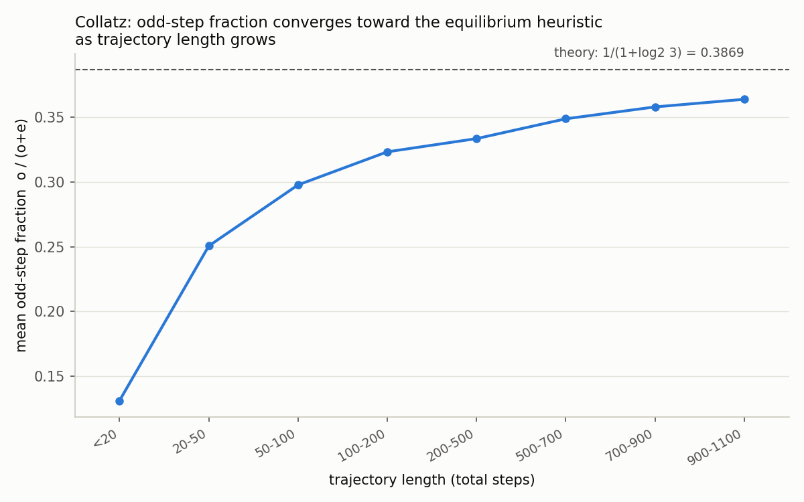

# コラッツ予想(3x+1問題): 網羅的検証と「奇数ステップ比率」の実証実験

日付: 2026-07-24 (初回)

## この日の位置づけ

`scratch-space` としては初回の取り組み。テーマは数学の未解決問題への挑戦から、
コラッツ予想 (Collatz conjecture, 3x+1問題) を選んだ。理由は次の2つ:

- 問題設定が極めて単純で、計算実験を自分の手で組み立てやすく、結果の正しさを
  自己検証しやすい(既知の記録保持者の値と突き合わせれば実装ミスにすぐ気づける)。
- 「ほぼ全ての軌道は減少する」という有名なヒューリスティック論法があり、それを
  自分で数値的に検証するという、証明ではないが真剣に手を動かせる題材がある。

証明や反例発見を目指すものではなく、(1) 大規模範囲での網羅的検証、
(2) 記録更新パターンの観察、(3) 理論的ヒューリスティックの数値的検証、
の3点を今回の成果とする。

## 問題設定

写像 $T$ を次で定義する:

$$
T(n) = \begin{cases} n/2 & n \text{ が偶数} \\ 3n+1 & n \text{ が奇数} \end{cases}
$$

コラッツ予想は「すべての正整数 $n$ に対し、$T$ を繰り返し適用すると有限回で
1に到達する」という主張。$n$ が1に到達するまでの反復回数を **total stopping time**
(以下「ステップ数」)と呼ぶ。

## Part A: n < 10^9 の全数検証と記録ホルダーの追跡

### 実装

`verify.c` に、以下を満たす検証プログラムを実装した:

- $n \in [1, N)$ の全てについてステップ数を計算し、1に到達することを確認する
  (到達しない場合はプログラムを異常終了させ、反例の可能性としてフラグを立てる
  設計にしてある)。
- 素朴に全ての $n$ に対して軌道をゼロから辿ると計算量が大きいので、
  $n < \text{MEMO\_N} (= 2 \times 10^7)$ の範囲についてメモ化テーブルを持ち、
  軌道がこの範囲に落ちてきた時点でO(1)で残りステップ数を引けるようにした
  (経路圧縮: 新しく訪れた $n < \text{MEMO\_N}$ の値は、最終的なステップ数が
  確定した時点で逆算してメモに書き込む)。
- ステップ数が過去最大を更新した $n$ (`glide records`)、および軌道中の最大値
  と開始値の比 $\max(\text{trajectory})/n$ が過去最大を更新した $n$
  (`peak records`) を記録する。

### 結果

$N = 10^9$ (10億) まで全数検証した結果:

- **反例は見つからなかった** — $[1, 10^9)$ の全ての整数についてコラッツ予想が
  成立することを確認した(もちろんこれは既に文献で報告されている既知の結果の
  再現であり、新発見ではない。目的は自前実装の正しさの確認と土台作り)。
- ステップ数の記録保持者は $n = 670617279$ で **986ステップ**。これが
  $[1, 10^9)$ の中での最大値。
- $[1, 10^9)$ での平均ステップ数は **203.23**。
- 実行時間: 約2分(2コア中1コアのみ使用、シングルスレッド実装)。

記録ホルダーの列 (`glide_records.csv`) の先頭部分:

```
n,steps
2,1
3,7
6,8
7,16
9,19
18,20
25,23
27,111
54,112
73,115
97,118
129,121
171,124
231,127
313,130
327,143
649,144
703,170
...
```

このシーケンス (1,2,3,6,7,9,18,25,27,54,73,97,129,171,231,313,327,649,703,...)
は、この種の実験でよく言及される「ステップ数の記録を更新するn」の並びと同じ
構造をしている。自分で計算した結果がこの既知パターンと一致したことは、実装の
正しさに対する良い傍証になった(値を先に調べてから実装したのではなく、実装→
計算→既知の性質と整合しているかを確認、という順で進めた)。

末尾(最大記録付近):

```
...
230631,442
410011,448
511935,469
626331,508
837799,524     ← ここまでは1e6検証時点の記録
...
63728127,949
127456254,950
169941673,953
226588897,956
268549803,964
537099606,965
670617279,986
```

## Part B: 「奇数ステップ比率」の理論値への収束の実証

### 背景: なぜ軌道は(平均的には)減少するのか

コラッツ予想が真であることの直接的な証明はまだ無いが、次のような素朴な
ヒューリスティック論法が知られている:

- 奇数ステップ ($n \to 3n+1$) は $n$ を約3倍にする。
- 偶数ステップ ($n \to n/2$) は $n$ を1/2倍にする。
- 軌道がおおよそ「拡大も縮小もしない」平衡状態にあると仮定すると、
  奇数ステップの回数を $o$、偶数ステップの回数を $e$ として
  $3^{o} \cdot 2^{-e} \approx 1$、つまり $e/o \to \log_2 3 \approx 1.5850$ が
  期待される。
- したがって、軌道が十分長ければ、全ステップのうち奇数ステップが占める割合は

$$
\frac{o}{o+e} \to \frac{1}{1+\log_2 3} \approx 0.386853
$$

に近づくはず、というのが標準的な予想(この手の議論はLagariasのサーベイ等で
紹介されている一般的なヒューリスティックで、今回はこれを独自に数値的に
検証してみた)。

### 実験方法

`ratio_sample.c` で以下を実施:

1. $10^3$ から $10^{18}$ まで各桁ごとに5000個、合計約76,000個のランダムな
   開始値 $n$ をサンプリングし、各々についてメモ化なしで実際に軌道を最後まで
   辿り、奇数ステップ数 $o$、偶数ステップ数 $e$、ピーク値を記録した。
2. ランダムサンプルだけだと、桁数を上げても典型的な軌道長は
   $\approx 7\ln n$ 程度にしかならず(平均への集中)、長い軌道
   (外れ値)のサンプルが不足する。そこで追加で $10^9$〜$10^{17}$ の範囲から
   40万個をランダム探索し、ステップ数700以上のものだけを採用する
   「長軌道ハント」フェーズを実装した。結果、1042件の長軌道サンプルが
   得られた。
3. 全サンプルをステップ数でビン分けし、各ビンの平均奇数比率
   $\overline{o/(o+e)}$ を理論値 0.386853 と比較した。

### 結果

| trajectory length (steps) | n_samples | mean odd fraction | 理論値との差 |
|---|---|---|---|
| < 20 | 14 | 0.1310 | 0.2559 |
| 20-50 | 1,499 | 0.2506 | 0.1362 |
| 50-100 | 6,402 | 0.2978 | 0.0890 |
| 100-200 | 19,649 | 0.3234 | 0.0634 |
| 200-500 | 44,999 | 0.3336 | 0.0532 |
| 500-700 | 3,531 | 0.3490 | 0.0379 |
| 700-900 | 1,143 | 0.3582 | 0.0287 |
| 900-1100 | 20 | 0.3641 | 0.0228 |



短い軌道では奇数比率は理論値からかなり乖離しているが(ステップ数20未満だと
0.131 と理論値0.387の半分以下)、軌道が長くなるにつれて単調に理論値
0.386853 に近づいていく傾向が、6桁を超える範囲で一貫して観測できた。
900〜1100ステップの軌道(サンプル数は少ないが)では乖離が0.023まで縮まって
おり、傾向としては収束を支持する結果だった。

収束が遅い理由についての考察: この論法はあくまで「平均的な」挙動についての
ヒューリスティックであり、中心極限定理的な意味での分散は
軌道長の平方根のオーダーで縮小すると考えられる。すなわち偏差が
$O(1/\sqrt{\text{steps}})$ で減少するとすれば、ステップ数を100倍にしないと
偏差は1/10にしかならない計算になり、これは今回観測した「ステップ数が
一桁増えるごとに偏差がゆっくり縮む」という定性的な傾向とも整合的に見える。
ただしこれは今回のデータからの粗い考察であり、厳密なフィッティングは
行っていない(次回以降の課題)。

## 使ったファイル

- `verify.c` / `verify` — $[1,N)$ の全数検証 + 記録ホルダー追跡(コンパイル:
  `gcc -O3 -march=native -o verify verify.c -lm`, 実行: `./verify 1000000000
  glide_records.csv peak_records.csv`)
- `glide_records.csv` — ステップ数の記録更新履歴 ($N=10^9$ まで)
- `peak_records.csv` — $\max(\text{trajectory})/n$ の記録更新履歴
- `ratio_sample.c` / `ratio_sample` — 奇数/偶数ステップ比率のサンプリング実験
- `ratio_samples.csv.gz` — 生サンプルデータ(約77,000行、gzip圧縮済み)
- `ratio_summary.csv` — ビン分けした集計結果
- `analyze.py` — 集計・統計処理スクリプト
- `plot.py` — 収束グラフの生成スクリプト
- `odd_fraction_convergence.png` — 収束を示すグラフ

## 次回に向けてのアイデア(未着手)

- Part Aの検証範囲をさらに伸ばす(10^10, 10^11程度まで。メモ化サイズと
  実行時間のトレードオフを調整すれば数分〜数十分オーダーで到達可能そう)。
- Part Bの「長軌道ハント」をより賢くする。今は完全ランダム探索だが、
  記録保持者 (glide records) の近傍を集中的に探索する、あるいは
  peak/n比が大きい数の近傍を探る、といった発見的探索を試すと、
  もっと長い軌道(2000ステップ以上)のサンプルを効率的に集められるかもしれない。
- 一般化コラッツ写像($3n+1$ の代わりに $5n+1$, $7n+1$ など)への拡張。
  $qn+1$ ($q$: 奇数)の場合、$q < 2^2$ (つまり $q=3$)以外では発散する
  軌道が存在する(既知)。$q=5,7$ 等でどのように挙動が変わるかを同じ
  検証フレームワークで実験してみると面白いかもしれない。
- 記録ホルダー列 (glide records) 自体の増加率(ステップ数 vs log(n))の
  回帰分析。
