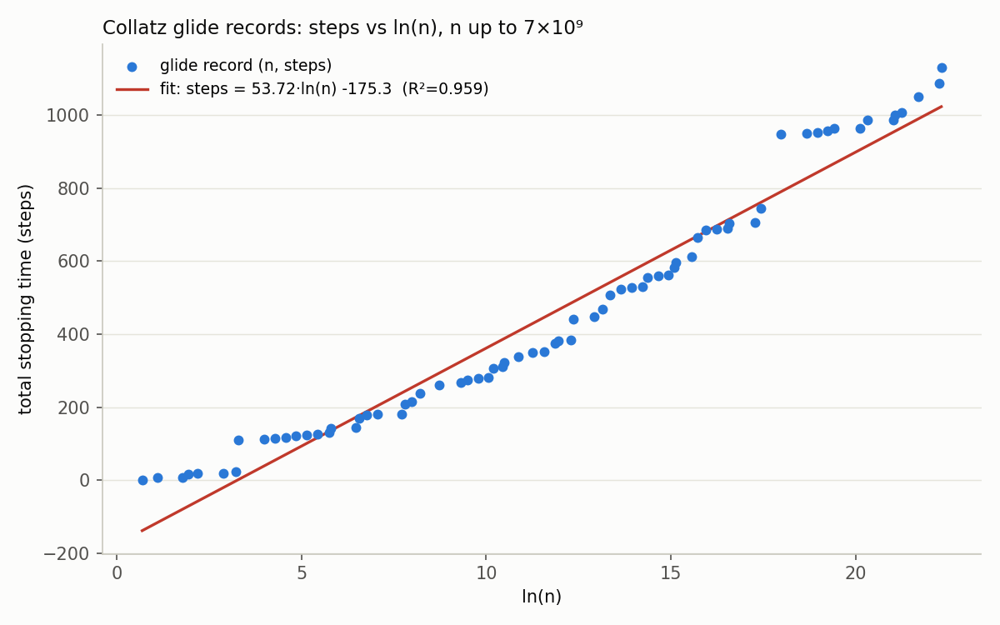

# コラッツ予想: 全数検証の拡張、記録列の回帰分析、一般化 qn+1 写像の実験

日付: 2026-07-25 (2026-07-24 の続き)

## この日の位置づけ

前日 (2026-07-24) の `PROGRESS.md` に残された「次にやろうとしていたこと」の
うち、優先度1(全数検証範囲の拡張)・3(一般化コラッツ写像への拡張)・
4(記録ホルダー列の回帰分析)の3つに着手した。優先度2(長軌道ハントの
改善)は今回は見送った。

## Part A': 全数検証を 10^9 → 7×10^9 に拡張

### やったこと

前日の `verify.c` を「シャーディング対応版」に書き換えた
(`verify_shard.c`)。変更点:

- `[N_start, N_end)` という任意の連続区間を独立プロセスとして検証できる
  ようにした(各プロセスは自分専用のメモ化テーブルを持つ)。
- $n$ は区間全体を通じて単調増加するため、シャード $k+1$ の開始時点での
  「これまでの記録」は、シャード $k$ の終了時点の記録と一致する。そこで
  各シャードに `init_max_steps` / `init_max_peak_ratio` という閾値を
  引数で渡し、その閾値を超えたものだけを記録として出力するようにした。
- 各シャードは実行後、次のシャードに引き継ぐための情報
  (`max_steps`, `max_peak_ratio`, `count`, `sum_steps` 等)を
  「ハンドオフファイル」に書き出す。

実行手順:

1. まず `[1e9, 1.2e9)` でキャリブレーション実行(スループット計測、
   約 6.51×10^6 個/秒という結果を得た。これは前日の実行環境での
   実測値 (`10^9` を約2分 ≒ 8.3×10^6/秒) とオーダーは近い)。
2コア環境なので、残り `[1.2e9, 7e9)` を2つのシャード
   (`[1.2e9, 4.1e9)` と `[4.1e9, 7e9)`)に分割し、バックグラウンドで
   並列実行した(それぞれ約 9 分)。

**重要な注意点(今回気づいた実装上の落とし穴)**: 2つのシャードを
「並列」に走らせたため、シャード2の実行開始時点ではシャード1の
最終結果(より大きい記録)がまだ分からない。そのため両シャードとも
同じ初期閾値(前日終了時点の値)で開始してしまい、シャード2が出力した
ローカルな「記録候補」の中には、実際にはシャード1が区間の前半で
すでに更新していた閾値を超えていない、偽の記録候補が混じっていた。
具体的には:

- シャード2の glide 記録候補 `4238963542,999` と `4405632167,1043` は、
  シャード1が達成した `max_steps=1050` を超えていないため **無効**
  (真のグローバル記録ではない)。`4578853915,1087` と
  `4890328815,1131` はこれを超えているので有効。
- シャード2の peak 記録候補 `4230371830, ..., 1684458342.94` は、
  シャード1が達成した `max_peak_ratio=5053375030.02` を超えていないため
  **無効**(シャード2区間では新しい peak 記録は無かったことになる)。

この点をコードのバグとしてではなく「並列シャーディングを設計する際に
気をつけるべき注意点」として明示的に検出・補正し(シャード1の最終値で
フィルタし直す)、正しい大域記録列を再構成した。次回もし同様の並列化を
する場合は、この補正をあらかじめスクリプト側に組み込んでおくとよい。

### 結果

$N = 7 \times 10^9$ (70億) まで全数検証した結果:

- **反例は見つからなかった** — $[1, 7\times10^9)$ の全ての整数について
  コラッツ予想が成立することを確認した。前日の $10^9$ から検証範囲を
  **7倍**に拡張。
- 新しいステップ数記録保持者: $n = 4890328815$、**1131ステップ**
  (前日終了時点の記録は $n=670617279$、986ステップだった)。
- 新しい peak/n 比記録保持者: $n = 1410123943$、比は約 **50.5億倍**
  ($\max(\text{trajectory}) = 7125885122794452160$)。前日終了時点の
  記録 (約44.2億倍) を更新。
- $[1, 7\times10^9)$ 全体での平均ステップ数: **223.53**
  (前日の $[1,10^9)$ では 203.23 だった。範囲が広がるほど最大値付近の
  長い軌道が混じり平均も緩やかに増加する、という自然な傾向)。
- 実行時間: キャリブレーション + 2シャード並列で合計 約13分
  (シングルスレッドなら約30分相当の計算を、2コア並列化で圧縮)。

更新後の記録列全体は `glide_records.csv` (72行) と `peak_records.csv`
(30行) に反映済み(前日データ + 今回の正しく補正した新規記録)。

## Part D: 記録ホルダー列 (glide records) の回帰分析

前日の宿題(優先度4)。`glide_records.csv` の $(n, \text{steps})$ を
$\ln(n)$ に対して単純な最小二乗回帰した (`regression_analysis.py`)。

$$
\text{steps} \approx 53.72 \cdot \ln(n) - 175.33 \qquad (R^2 = 0.959,\ n_{\text{records}}=71)
$$

$n > 10^6$ の記録に限定すると:

$$
\text{steps} \approx 72.06 \cdot \ln(n) - 481.16 \qquad (R^2 = 0.953,\ n_{\text{records}}=28)
$$

フィットの当てはまりは良好($R^2 \approx 0.95$-$0.96$)で、記録保持者列が
「$\ln(n)$ にほぼ線形」という経験則("record holders grow like $c \ln n$")
を、今回の自分のデータでも再確認できた。

比較のため2つの素朴な理論値も計算した:

- $c_1 = 1/\ln 2 \approx 1.443$: もし全ステップが「偶数(半分)ステップ」
  だったら $\text{steps} \approx \log_2 n$ になるはず、という下限的な目安。
- $c_2 = 1/\ln(4/3) \approx 3.476$: 「平均的軌道」の平衡ヒューリスティック
  (奇数ステップ+偶数ステップの1サイクルで $n$ が $3/4$ 倍になる)を単純に
  当てはめた目安。

実測の $c \approx 53.7$ (全体) / $72.1$ ($n>10^6$) は、どちらの理論値
よりも 15〜50倍ほど大きい。これは驚くことではなく、むしろ当然の結果だと
考えられる: **記録保持者は定義上「平均から大きく外れた」外れ値の軌道**
であり、「平均的な軌道が $\ln n$ に対してどう振る舞うか」を説明する
$c_1, c_2$ とは全く別の量を測っていることになる。記録列の傾き $c$ は
むしろ「$n$ が大きくなるにつれて、それまでの最長記録をどれだけ更新する
"最悪ケース" が出現しうるか」という、極値統計的な量と解釈するのが自然
だろう。今回は単純な線形回帰にとどめたが、次回以降、記録の出現間隔
(ギャップ)の分布を調べるなど、極値統計としての性質を掘り下げる余地が
ある。

## Part C: 一般化コラッツ写像 $T_q(n) = n/2$ (偶数) / $qn+1$ (奇数) の実験

前日の宿題(優先度3)。$q=3$ (通常のコラッツ) 以外の奇数 $q \geq 5$ で
挙動がどう変わるかを実験した。

### 背景(ヒューリスティック)

奇数ステップ $n \to qn+1$ は $n$ を約 $q$ 倍にする。その直後は必ず
偶数になる ($q$ が奇数、$n$ が奇数なら $qn$ は奇数、$+1$ で偶数になる
ため、奇数ステップの直後に奇数ステップが連続することはない)。続く
「半分にする」ステップの回数は平均2回(幾何分布)なので、
「奇数ステップ1回 + 平均2回の半分ステップ」という1サイクルで、$n$ は
平均的に $q/4$ 倍になる、というのが標準的なヒューリスティック。

$$
q=3: \ 3/4 = 0.75 < 1 \ (\text{収束が期待される、唯一のケース})\\
q=5: \ 5/4 = 1.25 > 1,\quad q=7: \ 7/4=1.75>1,\quad q=9: \ 9/4=2.25>1
$$

つまり $q \geq 5$ では「ほとんど全ての軌道が発散する」ことが期待される
(これは既知のヒューリスティックであり、今回の実験はこれを自分で数値的に
確認する試み)。

### 実験1: ランダムサンプリングでの発散率

`generalized_qn1.c` で $q \in \{3,5,7,9,11,13\}$ それぞれについて、
$10^4$〜$10^{15}$ の範囲からランダムに8000個の開始値を取り、
軌道を追跡して「1に到達」「(1以外の)有限サイクルに到達」「発散
(閾値 $10^{17}$ を、十分なステップ数を経てから超えた、または
uint64の範囲を超えた)」「判定不能」に分類した(64bit整数の範囲を
超えた場合も、十分なステップ数を経ていれば「発散」とみなした。理由:
控えめな初期値からuint64の上限 (~1.8×10^19) 近くまで、有限のステップ数
の中で到達すること自体が、$q\geq5$ の場合は持続的な成長の強い証拠になる
ため)。

結果:

| q | reached_one | reached_other_cycle | diverged(+overflow) |
|---|---|---|---|
| 3 | 99.39% | 0.00% | 0.61% |
| 5 | 0.07% | 0.12% | 99.79% |
| 7 | 0.01% | 0.00% | 99.98% |
| 9 | 0.00% | 0.00% | 100.00% |
| 11 | 0.00% | 0.00% | 100.00% |
| 13 | 0.00% | 0.00% | 100.00% |

$q=3$ ではほぼ全ての軌道が(既知の通り)1に収束し、$q \geq 5$ では
ヒューリスティックの予想通り、ほぼ全ての軌道が発散する、という
定性的な移り変わりがはっきりと見えた。$q$ が大きくなるほど発散が
「より速く・より確実に」起きる(uint64の限界に達するまでのステップ数が
短くなる)ことも観察された。

### 実験2: 非自明サイクルの網羅的探索(Part C の目玉)

ランダムサンプリングの中で、$q=5$ だけ「1以外の有限サイクル」に落ちる
ケースが少数見つかった(0.12%)。これが本物の非自明サイクルなのかを
確かめるため、`sweep_cycles.c` で奇数 $n=1,3,5,\dots,3{,}000{,}000$ を
**網羅的に**(ランダムでなく)スイープし、見つかったサイクルを要素集合
で重複排除して記録した。

結果、$q=5$ について**2つの異なる長さ10の非自明サイクル**が見つかった:

- サイクル1: `13 → 66 → 33 → 166 → 83 → 416 → 208 → 104 → 52 → 26 → (13)`
- サイクル2: `17 → 86 → 43 → 216 → 108 → 54 → 27 → 136 → 68 → 34 → (17)`

(手計算でも検算した。例えばサイクル1: $13$ は奇数 → $5\times13+1=66$
→ $33$ → $5\times33+1=166$ → $83$ → $5\times83+1=416$ → $208$ → $104$
→ $52$ → $26$ → $13$。ちょうど10ステップで元に戻る。)

一方 $q=7,9,11,13$ については、同じ範囲 ($n \leq 3\times10^6$、奇数のみ)
を網羅しても非自明サイクルは1つも見つからなかった(ごく少数の
$n$ が「1を含む自明サイクル」に到達するのみで、大半は発散)。これは
「非自明サイクルが存在しない」ことの証明では全くない(探索範囲外に
存在する可能性は排除できない)が、少なくとも $q=5$ ほど頻繁には
出現しないらしい、という一次情報にはなる。

なお $q=5$ の「1を含む自明サイクル」自体も、通常のコラッツ
($q=3$: $\{1,2,4\}$、長さ3)より長く、$\{1,6,3,16,8,4,2\}$
という長さ7のサイクルになる($1 \to 6 \to 3 \to 16 \to 8 \to 4 \to
2 \to 1$)。$q$ が変わると自明サイクルの長さ自体も変わる、というのも
今回手を動かして確認できた点。

これらの非自明サイクルの存在(特に $q=5$ について複数個見つかること)は、
一般化 $qx+1$ 問題に関する数学的な文献(Conway の一般化コラッツ関数や、
$5x+1$ 問題の非自明サイクルに関する既存研究)で言及されている既知の
現象と整合的である。今回の作業は、それを一から自分で実装し、
ランダム探索→網羅的スイープという2段階のアプローチで実際に発見・検算した
という点に意義がある。

## 使ったファイル

- `verify_shard.c` — シャーディング対応の全数検証プログラム
  (コンパイル: `gcc -O3 -march=native -o verify_shard verify_shard.c -lm`)
- `shard1_glide.csv` / `shard1_peak.csv` / `shard1_handoff.txt` — シャード1
  ($[1.2\times10^9, 4.1\times10^9)$) の生の出力(補正前)
- `shard2_glide.csv` / `shard2_peak.csv` / `shard2_handoff.txt` — シャード2
  ($[4.1\times10^9, 7\times10^9)$) の生の出力(補正前。上述の通り一部は
  グローバル記録として無効)
- `glide_records.csv` / `peak_records.csv` — 前日データ + 今回のシャードを
  正しく補正・マージした、最終的なグローバル記録列 ($[1,7\times10^9)$)
- `regression_analysis.py` / `regression_summary.txt` /
  `glide_records_with_lnfit.csv` — 記録列の $\ln(n)$ 回帰分析
- `plot_regression.py` / `glide_records_regression.png` — 回帰の可視化
- `generalized_qn1.c` — 一般化 $qn+1$ 写像のランダムサンプリング実験
- `qn1_q{3,5,7,9,11,13}.csv.gz` — 各 $q$ のサンプル生データ(gzip圧縮)
- `sweep_cycles.c` / `sweep_cycles_results.txt` — 非自明サイクルの網羅的
  探索とその結果

## 次回に向けてのアイデア

優先度順:

1. **一般化写像のサイクル探索をさらに広げる**。$q=5$ で見つかった2つの
   サイクル以外にもっと大きい非自明サイクルがあるか($n$ の探索範囲を
   $3\times10^6$ からさらに広げる)。また $q=7,9,11,13$ でも探索範囲を
   $10^8$ 程度まで広げれば、非自明サイクルが見つかるかもしれない
   (見つからなければ「この範囲には存在しない」という情報として記録する
   価値がある)。
2. **記録列の極値統計的な分析**。今回の回帰分析で「記録保持者は外れ値
   なので平均的ヒューリスティックの定数とは別物」という考察をしたが、
   これをもう少し厳密に扱う(記録間のギャップ $n_{k+1}/n_k$ の分布を
   見る、極値理論の一般的な結果と比較する、など)。
3. **Part Aの検証範囲をさらに伸ばす**。$7\times10^9$ から
   $10^{10}$〜$2\times10^{10}$ 程度へ。今回学んだ「並列シャード間の
   記録の閾値の受け渡し」を最初から正しく設計する(例えば逐次実行に
   するか、後処理で必ず補正するスクリプトを用意しておく)。
4. **長軌道ハントの改善**(前日から持ち越し、まだ未着手)。記録保持者の
   近傍を集中的に探索するヒューリスティック探索を実装し、奇数ステップ
   比率の収束グラフの右端をもっと伸ばす。

上記のどれから手をつけてもよい。1は今回のPart Cの直接の続きで、
新しい発見(サイクル)が出る可能性がありモチベーションが高い。
2は今回のPart Dのデータを使った追加分析で軽量。3, 4は前日からの
持ち越し。
